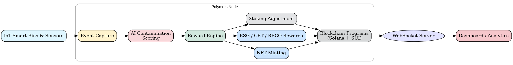

# 🌐 Polymers Node – IoT Validator & Reward Engine

**Polymers Node** is a **production-grade DePIN / IoT validator node** for the Polymers Network.  
It validates recycling events, executes **AI contamination scoring**, orchestrates devices, calculates **dynamic rewards**, mints **NFTs**, issues **ESG tokens**, and integrates with **Solana & SUI blockchain programs**.

---

## 🚀 Key Features

✨ **IoT Event Capture** – Real-time events from smart bins, sensors, and cameras  
🧠 **AI Contamination Scoring** – Detect contamination and compute cleaned area contribution  
⚖️ **Dynamic Rewards Engine** – Calculates RECO / CRT / PLY rewards with DAO bonuses  
🎨 **NFT Minting & Metadata** – On-chain digital twins for scanned items  
📡 **Multi-Device Orchestration** – High-frequency, batch IoT event handling  
🔒 **Staking & Uptime Tracking** – Dynamic rewards based on node reliability  
⚡ **WebSocket Server** – Live updates to dashboards and analytics  
⛓ **Cross-Chain Integration** – Solana + SUI program calls for NFT, staking, and tokens  
🌱 **Analytics & ESG Mapping** – Cleaned areas, ESG scores, and leaderboards  

---

## 🏗 Node Architecture

```text
IoT Smart Bins → Polymers Node
   │               │
   ├─ Event Capture │
   │               ├─ AI Contamination Scoring
   │               │
   │               ├─ Reward Engine
   │               │    ├─ NFT Minting
   │               │    ├─ ESG / CRT / RECO Rewards
   │               │    └─ Staking Adjustment
   │               │
   │               └─ Blockchain Programs (Solana + SUI)
   │
   └─ WebSocket → Dashboard / Analytics
````

### 📊 Architecture Diagram


🔎 [High-resolution SVG version](./docs/polymers_node_architecture.svg)

---

## 🌍 Ecosystem Overview

Polymers Node is part of a **larger DePIN + Blockchain ecosystem**, bridging IoT devices, AI validation, tokenized rewards, and DAO governance.

### 📊 Ecosystem Flow Diagram


🔎 [High-resolution SVG version](./docs/polymers_ecosystem_flow.svg)

---

## 📂 Folder Structure

```text
packages/backend/
├─ src/
│  ├─ index.ts             # Node entrypoint
│  ├─ routes/
│  │  └─ scan.ts           # IoT scan event API
│  ├─ services/
│  │  ├─ aiService.ts      # Contamination scoring
│  │  ├─ rewardService.ts  # Reward calculation & blockchain triggers
│  │  ├─ stakingService.ts # Node staking & uptime monitoring
│  │  └─ deviceService.ts  # Multi-device orchestration
│  ├─ websocket/
│  │  └─ wsServer.ts       # Live WebSocket updates
│  └─ utils/
│     ├─ blockchain.ts     # Solana + SUI program calls
│     ├─ constants.ts
│     └─ types.ts
├─ package.json
└─ tsconfig.json
```

---

## ⚙️ Prerequisites

* Node.js **>= 18**
* Docker & Docker Compose (for full-stack deployment)
* Solana & SUI wallets for NFT & reward execution
* AI model files for contamination scoring

---

## 💻 Local Development

1️⃣ Install dependencies

```bash
cd packages/backend
npm install
```

2️⃣ Configure environment variables

```bash
cp .env.example .env
```

3️⃣ Start node locally

```bash
npm run dev
```

---

## 🏭 Production Deployment

🚢 **Docker Compose** for full stack deployment

```bash
chmod +x ../../deploy.sh
../../deploy.sh
```

* **Backend API:** `http://localhost:4000/api/scan`
* **WebSocket:** `ws://localhost:4001`

---

## 🔗 API Endpoints

| Endpoint              | Method | Description                                                                    |
| --------------------- | ------ | ------------------------------------------------------------------------------ |
| `/api/scan`           | POST   | Receives IoT bin scan events (tagID, weight, contamination image, geolocation) |
| `/api/node/status`    | GET    | Returns node uptime, staking status, and reward summary                        |
| `/api/reward/execute` | POST   | Triggers reward execution for a validated scan event                           |
| `/api/esg/metrics`    | GET    | Returns ESG scores, cleaned area maps, and leaderboard metrics                 |

---

## 🧠 AI & Reward Engine

📌 **Contamination Scoring** – Evaluates sensor & image data for contamination
📌 **Dynamic Reward Formula**

```text
Reward_RECO = BaseValue + ΔWeight × WeightFactor + TrustMultiplier + Bonus + DAO Bonus
```

📌 **NFT Minting** – Solana & SUI digital twin NFTs
📌 **ESG / CRT Issuance** – On-chain credits & tokenized rewards

---

## ⚡ Staking & Multi-Device Orchestration

* 🔒 **PLY Token Staking:** Dynamic rewards based on uptime & reliability
* 📡 **Multi-Device Handling:** Batch IoT event processing
* 🛡 **Node Status Tracking:** Health monitoring & slashing if thresholds missed

---

## 📡 WebSocket Integration

📡 **Real-Time Updates:**

* Scan events
* Rewards issued
* NFTs minted
* ESG / CRT metrics

🖥 **Frontend Subscription:**
Connect dashboards → `ws://localhost:4001`

---

## 🌱 Environment Variables

Example `.env`:

```ini
BACKEND_PORT=4000
WS_PORT=4001

SOLANA_RPC_URL=https://api.devnet.solana.com
SUI_RPC_URL=https://fullnode.devnet.sui.io:443
SOLANA_WALLET_PRIVATE_KEY=<key>
SUI_WALLET_PRIVATE_KEY=<key>

BASE_REWARD_RECO=1.0
WEIGHT_FACTOR=0.05
TRUST_MULTIPLIER=0.1
DAO_BONUS=0.05
STAKING_REWARD_FACTOR=0.02
UPTIME_THRESHOLD=0.95

SIM_DEVICE_COUNT=5
SIM_INTERVAL_MS=5000

AI_MODEL_PATH=./ai/model
```

---

## ✅ Quick Start Recap

1. Configure `.env` with wallets, staking parameters, AI model path
2. Start node

```bash
npm run dev
```

or via full-stack Docker

```bash
../../deploy.sh
```

3. Observe **scan events, AI scoring, rewards, NFT minting, ESG updates**
4. Dashboards auto-update in **real time via WebSocket**

Would you like me to also **apply a color theme (consistent accent colors for diagrams + README badges)** so the visuals match your branding (e.g., Polymers blue/green palette)?
```
